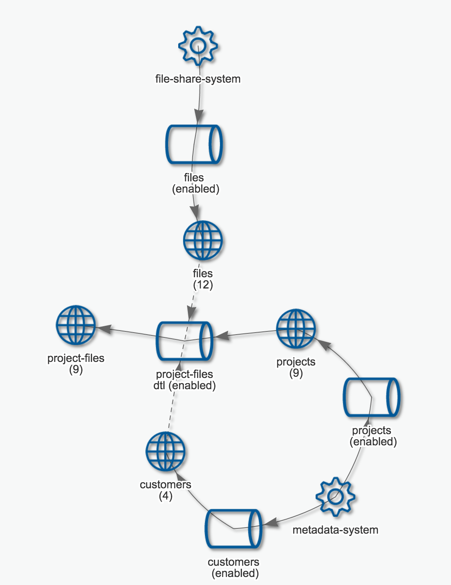
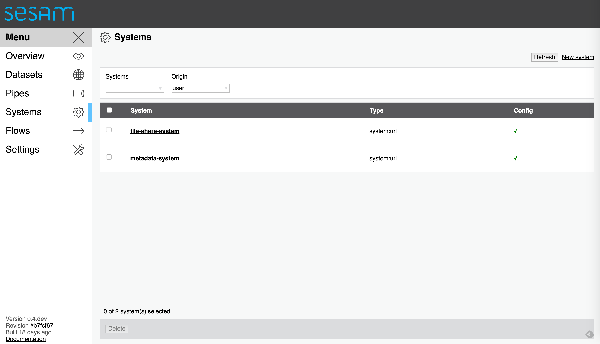
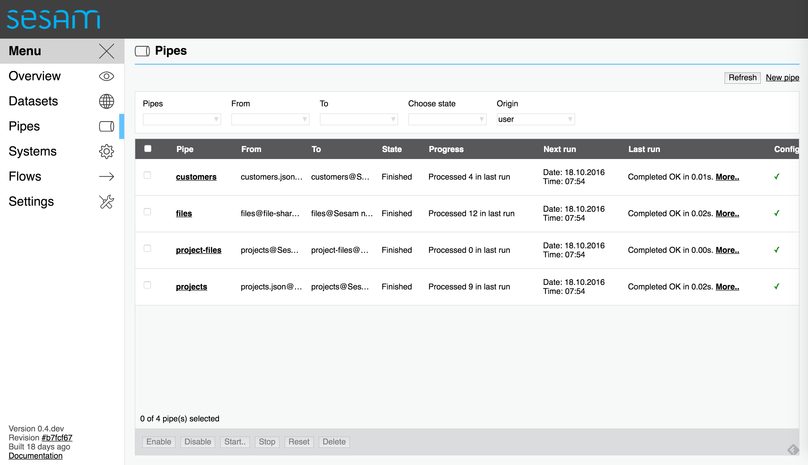
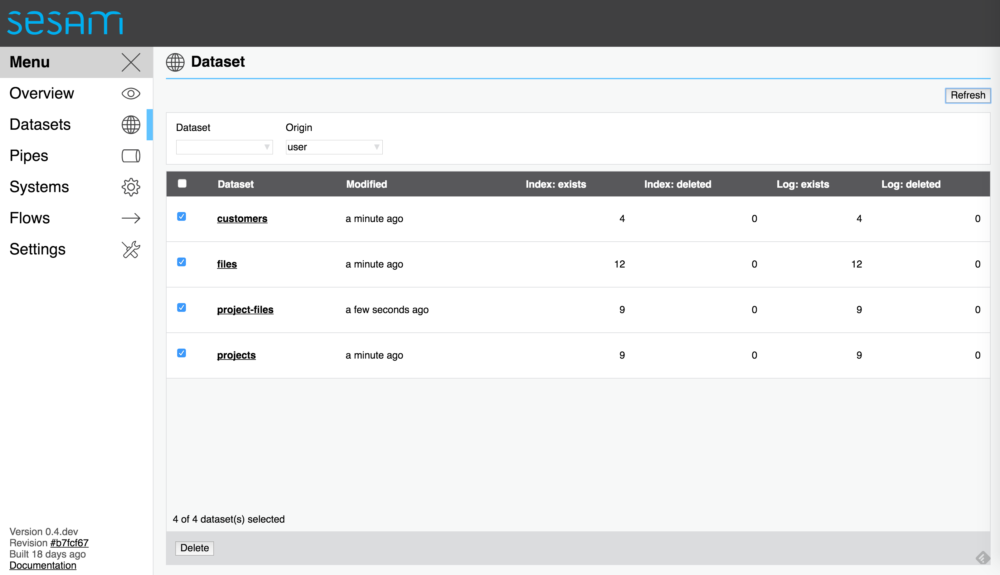
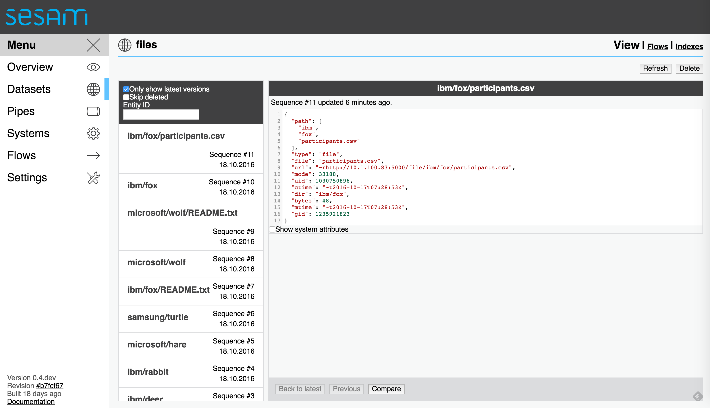
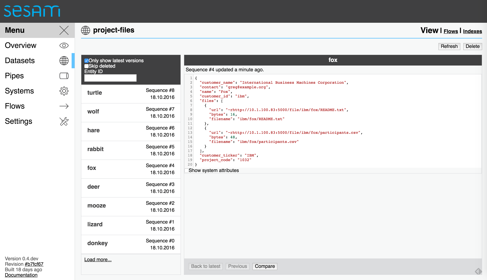

=========================================
Using Sesam to enrich your portfolio data
=========================================

.. contents:: Table of Contents
   :depth: 2
   :local:

It's quite common to have a file-system folder structure where you
have conventions for what each folder represents, e.g. individual
customers or projects. Here we'll show how you can share such a folder
structure and its contents with `Sesam <https://sesam.io/>`_.

The file-share microservice
===========================

Clone the Git repository
------------------------

We've built a small file-share `microservice
<https://github.com/sesam-io/file-share-service>`_ that exposes the
file structure as a stream of JSON. The code and the sample project
can be checked out using Git like this:

::

  $ git clone git@github.com:sesam-io/file-share-service.git
  Cloning into 'file-share-service'...
  remote: Counting objects: 52, done.
  remote: Compressing objects: 100% (34/34), done.
  remote: Total 52 (delta 12), reused 50 (delta 10), pack-reused 0
  Receiving objects: 100% (52/52), 13.50 KiB | 0 bytes/s, done.
  Resolving deltas: 100% (12/12), done.

For illustration purposes this project includes a `sample portfolio
<https://github.com/sesam-io/file-share-service/tree/master/sample/portfolio>`_.

The portfolio consists of three customers and a few projects that have animal
names. Some of the project folders contain files.

::

  $ tree sample/portfolio
  sample/portfolio
  ├── ibm
  │   ├── deer
  │   ├── fox
  │   │   ├── README.txt
  │   │   └── participants.csv
  │   └── rabbit
  ├── microsoft
  │   ├── hare
  │   └── wolf
  │       └── README.txt
  └── samsung
      └── turtle
  
  9 directories, 3 files

Build the Docker image
----------------------

Now, let's expose this portfolio structure as a stream of JSON
entities that can be consumed by Sesam. We'll use Docker, but the
`project description
<https://github.com/sesam-io/file-share-service>`_ contains
information on how to run it directly instead.

First we'll have to build the Docker image:

::

  $ docker build -t sesam/file-share-service .

This command builds the Docker image and tags it as ``sesam/file-share-service``.

Start the service
-----------------

We can now start the service:

::

  $ docker run --name file-share-service --rm -it -p 5000:5000 -v $PWD/sample/portfolio:/file-share sesam/file-share-service

This will run the service, bind the service to port 5000, and mount
the local directory ``$PWD/sample/portfolio`` into the container. The
stream of JSON entities can now be retrieved from
'http://localhost:5000/files'.

Get the stream of exposed files
-------------------------------

The commands below uses `curl <https://curl.haxx.se/>`_ to send the requests and `jq <https://stedolan.github.io/jq/>`_ to prettify the response.

Get all the files and directories:

::

  $ curl -s 'http://localhost:5000/files' | jq . -S
  [
    {
      "_id": "ibm",
      "_updated": "2016-10-14T12:40:33Z",
      "atime": "~t2016-10-17T07:30:42Z",
      "bytes": 170,
      "ctime": "~t2016-10-14T12:40:33Z",
      "dir": "",
      "file": "ibm",
      "gid": 1235921823,
      "mode": 16877,
      "mtime": "~t2016-10-14T12:40:33Z",
      "path": [
        "ibm"
      ],
      "type": "dir",
      "uid": 1030750896
    },
    {
      "_id": "microsoft",
      "_updated": "2016-10-14T12:40:45Z",
      "atime": "~t2016-10-17T07:30:42Z",
      "bytes": 136,
      "ctime": "~t2016-10-14T12:40:45Z",
      "dir": "",
      "file": "microsoft",
      "gid": 1235921823,
      "mode": 16877,
      "mtime": "~t2016-10-14T12:40:45Z",
      "path": [
        "microsoft"
      ],
      "type": "dir",
      "uid": 1030750896
    },
    {
      "_id": "samsung",
      "_updated": "2016-10-14T12:42:05Z",
      "atime": "~t2016-10-17T07:30:42Z",
      "bytes": 102,
      "ctime": "~t2016-10-14T12:42:05Z",
      "dir": "",
      "file": "samsung",
      "gid": 1235921823,
      "mode": 16877,
      "mtime": "~t2016-10-14T12:42:05Z",
      "path": [
        "samsung"
      ],
      "type": "dir",
      "uid": 1030750896
    },
    {
      "_id": "ibm/deer",
      "_updated": "2016-10-14T18:28:29Z",
      "atime": "~t2016-10-17T07:30:42Z",
      "bytes": 102,
      "ctime": "~t2016-10-14T18:28:29Z",
      "dir": "ibm",
      "file": "deer",
      "gid": 1235921823,
      "mode": 16877,
      "mtime": "~t2016-10-14T18:28:29Z",
      "path": [
        "ibm",
        "deer"
      ],
      "type": "dir",
      "uid": 1030750896
    },
    {
      "_id": "ibm/rabbit",
      "_updated": "2016-10-14T18:28:33Z",
      "atime": "~t2016-10-17T07:30:42Z",
      "bytes": 102,
      "ctime": "~t2016-10-14T18:28:33Z",
      "dir": "ibm",
      "file": "rabbit",
      "gid": 1235921823,
      "mode": 16877,
      "mtime": "~t2016-10-14T18:28:33Z",
      "path": [
        "ibm",
        "rabbit"
      ],
      "type": "dir",
      "uid": 1030750896
    },
    {
      "_id": "microsoft/hare",
      "_updated": "2016-10-14T18:28:42Z",
      "atime": "~t2016-10-17T07:30:42Z",
      "bytes": 102,
      "ctime": "~t2016-10-14T18:28:42Z",
      "dir": "microsoft",
      "file": "hare",
      "gid": 1235921823,
      "mode": 16877,
      "mtime": "~t2016-10-14T18:28:42Z",
      "path": [
        "microsoft",
        "hare"
      ],
      "type": "dir",
      "uid": 1030750896
    },
    {
      "_id": "samsung/turtle",
      "_updated": "2016-10-14T18:28:57Z",
      "atime": "~t2016-10-17T07:30:42Z",
      "bytes": 102,
      "ctime": "~t2016-10-14T18:28:57Z",
      "dir": "samsung",
      "file": "turtle",
      "gid": 1235921823,
      "mode": 16877,
      "mtime": "~t2016-10-14T18:28:57Z",
      "path": [
        "samsung",
        "turtle"
      ],
      "type": "dir",
      "uid": 1030750896
    },
    {
      "_id": "ibm/fox/README.txt",
      "_updated": "2016-10-15T08:11:11Z",
      "atime": "~t2016-10-17T07:26:21Z",
      "bytes": 16,
      "ctime": "~t2016-10-15T08:11:11Z",
      "dir": "ibm/fox",
      "file": "README.txt",
      "gid": 1235921823,
      "mode": 33188,
      "mtime": "~t2016-10-15T08:11:11Z",
      "path": [
        "ibm",
        "fox",
        "README.txt"
      ],
      "type": "file",
      "uid": 1030750896,
      "url": "~rhttp://localhost:5000/file/ibm/fox/README.txt"
    },
    {
      "_id": "microsoft/wolf",
      "_updated": "2016-10-17T07:27:04Z",
      "atime": "~t2016-10-17T07:30:42Z",
      "bytes": 136,
      "ctime": "~t2016-10-17T07:27:04Z",
      "dir": "microsoft",
      "file": "wolf",
      "gid": 1235921823,
      "mode": 16877,
      "mtime": "~t2016-10-17T07:27:04Z",
      "path": [
        "microsoft",
        "wolf"
      ],
      "type": "dir",
      "uid": 1030750896
    },
    {
      "_id": "microsoft/wolf/README.txt",
      "_updated": "2016-10-17T07:27:04Z",
      "atime": "~t2016-10-17T07:29:02Z",
      "bytes": 17,
      "ctime": "~t2016-10-17T07:27:04Z",
      "dir": "microsoft/wolf",
      "file": "README.txt",
      "gid": 1235921823,
      "mode": 33188,
      "mtime": "~t2016-10-17T07:27:04Z",
      "path": [
        "microsoft",
        "wolf",
        "README.txt"
      ],
      "type": "file",
      "uid": 1030750896,
      "url": "~rhttp://localhost:5000/file/microsoft/wolf/README.txt"
    },
    {
      "_id": "ibm/fox",
      "_updated": "2016-10-17T07:28:53Z",
      "atime": "~t2016-10-17T07:30:42Z",
      "bytes": 136,
      "ctime": "~t2016-10-17T07:28:53Z",
      "dir": "ibm",
      "file": "fox",
      "gid": 1235921823,
      "mode": 16877,
      "mtime": "~t2016-10-17T07:28:53Z",
      "path": [
        "ibm",
        "fox"
      ],
      "type": "dir",
      "uid": 1030750896
    },
    {
      "_id": "ibm/fox/participants.csv",
      "_updated": "2016-10-17T07:28:53Z",
      "atime": "~t2016-10-17T07:29:42Z",
      "bytes": 48,
      "ctime": "~t2016-10-17T07:28:53Z",
      "dir": "ibm/fox",
      "file": "participants.csv",
      "gid": 1235921823,
      "mode": 33188,
      "mtime": "~t2016-10-17T07:28:53Z",
      "path": [
        "ibm",
        "fox",
        "participants.csv"
      ],
      "type": "file",
      "uid": 1030750896,
      "url": "~rhttp://localhost:5000/file/ibm/fox/participants.csv"
    }
  ]

Get files changed after specific time
-------------------------------------

We can also get a list of the files and directories that have been modified after a specific point in time:

::

  $ curl -s 'http://localhost:5000/files?since=2016-10-17T07:27:04Z' | jq . -S
  [
    {
      "_id": "ibm/fox",
      "_updated": "2016-10-17T07:28:53Z",
      "atime": "~t2016-10-17T07:31:49Z",
      "bytes": 136,
      "ctime": "~t2016-10-17T07:28:53Z",
      "dir": "ibm",
      "file": "fox",
      "gid": 1235921823,
      "mode": 16877,
      "mtime": "~t2016-10-17T07:28:53Z",
      "path": [
        "ibm",
        "fox"
      ],
      "type": "dir",
      "uid": 1030750896
    },
    {
      "_id": "ibm/fox/participants.csv",
      "_updated": "2016-10-17T07:28:53Z",
      "atime": "~t2016-10-17T07:29:42Z",
      "bytes": 48,
      "ctime": "~t2016-10-17T07:28:53Z",
      "dir": "ibm/fox",
      "file": "participants.csv",
      "gid": 1235921823,
      "mode": 33188,
      "mtime": "~t2016-10-17T07:28:53Z",
      "path": [
        "ibm",
        "fox",
        "participants.csv"
      ],
      "type": "file",
      "uid": 1030750896,
      "url": "~rhttp://localhost:5000/file/ibm/fox/participants.csv"
    }
  ]

Downloading specific files
--------------------------

If the entity contains the ``url`` property, then the contents of the file can be downloaded. The last one in the previous response, `ibm/fox/README.txt <https://github.com/sesam-io/file-share-service/blob/master/sample/portfolio/ibm/fox/README.txt>`_, has a URL and can be downloaded like this:

::

   $ curl -s 'http://localhost:5000/file/ibm/fox/README.txt'
   Hello, I'm Fox!

Integrating with Sesam
======================

The ``samples`` directory contains a Sesam `configuration file
<https://github.com/sesam-io/file-share-service/blob/master/sample/sesam.conf.json>`_
that sets up a pipe that will consume the ``file-share`` microservice.

This flow diagram shows the overall dataflow that we're targetting:

First we'll start out by reading the ``http://YOUR-IP-HERE:5000/files`` endpoint and write the result into a Sesam dataset called ``files``. Next, we'll import two JSON files that contains data about customers and projects. These will be imported into the datasets ``customers`` and ``projects``. Finally, we'll combine data from all three datasets into a new dataset called ``project-files``.

Importing the file structure
----------------------------

::

  [
    {
        "_id": "file-share-system",
        "type": "system:url",
        "base_url": "http://YOUR-IP-HERE:5000/"
    },
    {
        "_id": "files",
        "type": "pipe",
        "source": {
            "type": "json",
            "system": "file-share-system",
            "url": "files"
        }
    },
    ...
  ]

The first part of the configuration above is a ``url`` system definition that refers to the microservice's base URL. The latter part is a pipe that reads the ``http://YOUR-IP-HERE:5000/files`` endpoint and writes the entities to a dataset called ``files``.

Importing extra metadata
------------------------

::

    ...
    {
        "_id": "metadata-system",
        "type": "system:url",
        "base_url": "http://YOUR-IP-HERE:8000/"
    },
    {
        "_id": "customers",
        "type": "pipe",
        "source": {
            "type": "json",
            "system": "metadata-system",
            "url": "customers.json"
        }
    },
    {
        "_id": "projects",
        "type": "pipe",
        "source": {
            "type": "json",
            "system": "metadata-system",
            "url": "projects.json"
        }
    },
    ...

This defines a ``url`` system that points to another microservice that we'll spin up next. This microservice will serve two JSON files `customers.json and projects.json <https://github.com/sesam-io/file-share-service/tree/master/sample/metadata>`_ that will get loaded into the ``customers`` and ``projects`` datasets in Sesam.

::

  $ cd sample/metadata
  $ python3 -m http.server
  Serving HTTP on 0.0.0.0 port 8000 ...

Projects in `projects.json <https://github.com/sesam-io/file-share-service/blob/master/sample/metadata/projects.json>`_ look like this:

::

  [
    ...
    {
        "_id": "fox",
        "name": "Fox",
        "project_code": "1032",
        "customer_id": "ibm",
        "contact": "greg@example.org"
    },
    ...
  ]

Customers in `customers.json <https://github.com/sesam-io/file-share-service/blob/master/sample/metadata/customers.json>`_ look like this:

::

  [
    ...
    {
        "_id": "ibm",
        "name": "International Business Machines Corporation",
        "ticker": "IBM"
    },
    ...
  ]

Enriching projects
------------------

::

    ...
    {
        "_id": "project-files",
        "type": "pipe",
        "source": {
            "type": "dataset",
            "dataset": "projects"
        },
        "transform": {
            "type": "dtl",
            "rules": {
                "default": [
                    ["copy", "*"],
                    ["merge",
                     ["apply-hops", "customer", {
                         "datasets": ["customers c"],
                         "where": [
                             ["eq", "_S.customer_id", "c._id"]
                         ]
                     }]
                    ],
                    ["add", "files",
                     ["apply-hops", "project-files", {
                         "datasets": ["files f"],
                         "where": [
                             ["eq", ["concat", ["list", "_S.customer_id", "/", "_S._id"]],
                              ["concat", ["list", ["first", "f.path"], "/", ["nth", 1, "f.path"]]]
                             ],
                             ["eq", "f.type", "file"]
                         ]
                     }]
                    ]
                ],
                "customer": [
                    ["rename", "name", "customer_name"],
                    ["rename", "ticker", "customer_ticker"]
                ],
                "project-files": [
                    ["add", "filename", "_S._id"],
                    ["add", "url", "_S.url"],
                    ["add", "bytes", "_S.bytes"]
                ]
            }
        }
    }
  ]

Finally, there's a pipe definition that takes the ``projects`` dataset as input and joins in extra data from the ``customer`` and ``files`` datasets. This pipe uses the `Data Transformation Language <https://docs.sesam.io/DTLReferenceGuide.html>`_ to enrich the data.

Importing the configuration into Sesam
--------------------------------------

Having looked at the parts of the ``sesam.conf.json`` configuration file we're now ready to import the configuration into Sesam and get started processing the data. Use the ``sesam`` `command line client <https://docs.sesam.io/commandlineclient.html>`_ or the Sesam Management Studion to import the file:

::

  $ sesam import sample/sesam.conf.json
  Read 6 config entities from these config-files:
    sample/sesam.conf.json

If we now visit the `Sesam Management Studio <https://docs.sesam.io/management-studio.html>`_ we can see that there are now two systems, four pipes and four datasets registered. After a few seconds the pipes will have run and the datasets have been populated.

Systems
^^^^^^^

Pipes
^^^^^

Datasets
^^^^^^^^

The ``files`` dataset
^^^^^^^^^^^^^^^^^^^^^

The ``project-files`` dataset
^^^^^^^^^^^^^^^^^^^^^^^^^^^^^

As one can see from the screenshot below the ``fox`` project now has the ``files`` property that have two files in it. The project also now have ``customer_name`` and ``customer_ticker`` properties.

Conclusion
==========

This has been a whirlwind guide to how we can use the ``file-share`` microservice with the `Sesam Data Integration Platform <https://docs.sesam.io/>`_. We've seen how we can build and run the ``file-share`` microservice. We've seen how we can configure Sesam to consume the service, how it can load additional data from JSON, process all the imported data and produce a new enriched dataset. 
